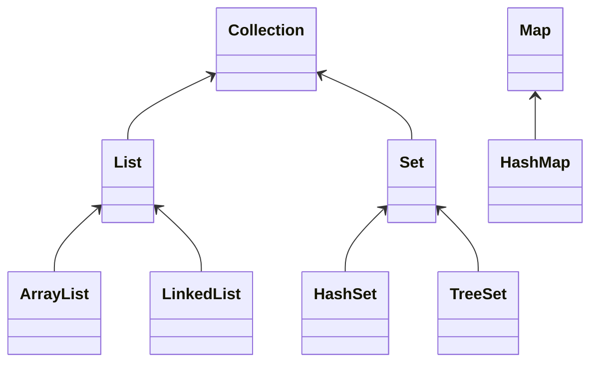

# java 基础类库

>(io 流，集合类，线程，Socket，AWT，Swing,sql)

-------

#### 1、java 中有几种类型的流？JDK 为每种类型的流提供了一些抽象类以供继承，请说出他们分别是哪些类?

> 字节流，字符流。字节流继承于 InputStream OutputStream，字符流继承于 Reader Writer。在 java.io 包中还有许多其他的流，低层流与调层流，高层流主要是为了提高性能和使用方便。

#### 2、启动一个线程是用 run()还是 start()?

> 启动一个线程是调用 start()方法，启动线程并调用 run 方法。

#### 3、线程的基本概念、线程的基本状态以及状态之间的关系

> 线程是进程内的并发，没有自已内存空间，共享进程的，线程间的通信成本较低。
>
> Java 中的线程有四种状态分别是：运行、就绪、挂起、结束。

#### 4、多线程有几种实现方法,都是什么?同步有几种实现方法,都是什么? 用什么关键字修饰同步方法? stop()和 suspend()方法为何不推荐使用？

> 两种分别为
>
> * Extends Thread
>
> * Implements Runnable


```java
//同步
Public synchronized aa(){


}
```


```java
Public void cc(object aa){
    synchronized(aa){

    }
}
//用 synchoronized 修饰同步方法。
```


答：多线程有两种实现方法，分别是继承 Thread 类与实现 Runnable 接口同步的实现方面有两种，分别是 synchronized,wait 与 notify

反对使用 stop()，是因为它不安全。它会解除由线程获取的所有锁定，而且如果对象处于一种不连贯状态，那么其他线程能在那种状态下检查和修改它们。结果很难检查出真正的问题所在。

suspend()方法容易发生死锁。调用 suspend()的时候，目标线程会停下来，但却仍然持有在这之前获得的锁定。此时，其他任何线程都不能访问锁定的资源，除非被"挂起"的线程恢复运行。对任何线程来说，如果它们想恢复目标线程，同时又试图使用任何一个锁定的资源，就会造成死锁。所以不应该使用 suspend()，而应在自己的 Thread 类中置入一个标志，指出线程应该活动还是挂起。若标志指出线程应该挂起，便用 wait()命其进入等待状态。若标志指出线程应当恢复，则用一个 notify() 重新启动线程。

#### 5、集合框架有什么?



#### 12、设计 4 个线程，其中两个线程每次对 j 增加 1，另外两个线程对 j 每次减少 1。写出程序


```java
public class TestThread

{

private int j;

public synchronized void inc()

{

j++;

System.out.println(Thread.currentThread().getName() + "-inc:" + j);

}

public synchronized void dec()

{

j--;

System.out.println(Thread.currentThread().getName() + "-dec:" + j);

}

public static void main(String[] args)

{

TestThread t=new TestThread();

for (int i = 0; i < 2; i++)

{

Thread inc=new Thread(new Inc(t));

Thread dec=new Thread(new Dec(t));

inc.start();

dec.start();

}

}

}

class Inc implements Runnable

{

private TestThread obj;


public Inc(TestThread obj)

{

this.obj=obj;

}

public void run()

{

//	for (int i = 0; i < 100; i++)

//	{

this.obj.inc();

//	}

}

}

class Dec implements Runnable

{

private TestThread obj;

public Dec(TestThread obj)

{

this.obj=obj;

}

public void run()

{

//	for (int i = 0; i < 100; i++)

//	{

this.obj.dec();

//	}

}

}
```

